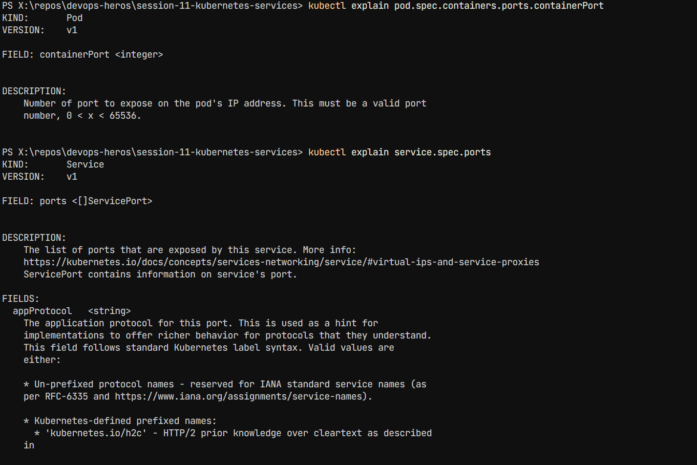
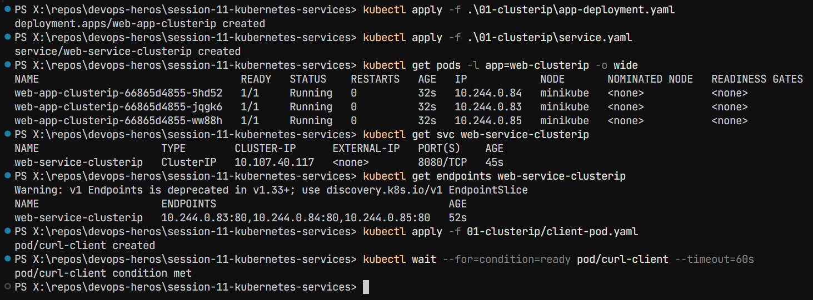
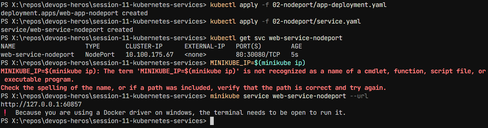

# Kubernetes Services - Session 11 (Lecture 11 & 12)

## Table of Contents

1. [Task 1: Kubernetes Port Architecture & Clarification Drill](#task-1-kubernetes-port-architecture--clarification-drill)
2. [Task 2: Type 1 Service — ClusterIP (Default Internal Networking)](#task-2-type-1-service--clusterip-default-internal-networking)
3. [Task 3: Type 2 Service — NodePort (Host-Level External Ingress)](#task-3-type-2-service--nodeport-host-level-external-ingress)
4. [Task 4: Type 3 Service — LoadBalancer (Cloud-Native Ingress Simulation)](#task-4-type-3-service--loadbalancer-cloud-native-ingress-simulation)
5. [Task 5: Type 4 Service — ExternalName (CoreDNS CNAME Alias Redirection)](#task-5-type-4-service--externalname-coredns-cname-alias-redirection)
6. [Task 6: Type 5 Service — Headless Service (clusterIP: None & Stateful Workloads)](#task-6-type-5-service--headless-service-clusterip-none--stateful-workloads)
7. [Task 7: Services Without Selectors (Manual Endpoints Mapping)](#task-7-services-without-selectors-manual-endpoints-mapping)
8. [Task 8: FQDN & CoreDNS Deep Dive Architecture Analysis](#task-8-fqdn--coredns-deep-dive-architecture-analysis)
9. [Task 9: Pod Identity & Lifecycle Invariance Drill](#task-9-pod-identity--lifecycle-invariance-drill)
10. [Task 10: Master Architectural Matrix — Deployment vs. StatefulSet vs. DaemonSet](#task-10-master-architectural-matrix--deployment-vs-statefulset-vs-daemonset)
11. [Task 11: Production Cost Optimization & Service Selection Decision Tree](#task-11-production-cost-optimization--service-selection-decision-tree)
12. [Task 12: Minikube Docker-Driver Port Binding & Tunnel Gotcha Analysis](#task-12-minikube-docker-driver-port-binding--tunnel-gotcha-analysis)

---

## Task 1: Kubernetes Port Architecture & Clarification Drill

**Short Description:** Document and visually map the 4 distinct port definitions in Kubernetes. Illustrate how a packet flows from an external client through the node, into the service, and down to the application process inside the container.

**Architecture Flowchart:**

```
Client Browser ──► [nodePort: 30080] (Host IP)
                        │
                        ▼
                   [port: 8080] (Service VIP)
                        │
                        ▼
                   [targetPort: 80] (Pod Network)
                        │
                        ▼
                   [containerPort: 80] (Container Engine / Nginx)
```

**Key Commands:**

```bash
# Inspect port declarations across pod and service
kubectl explain pod.spec.containers.ports.containerPort
kubectl explain service.spec.ports
```

**Screenshot:**


---

## Task 2: Type 1 Service — ClusterIP (Default Internal Networking)

**Short Description:** Deploy a 3-replica backend (web-app-clusterip), create a ClusterIP Service, verify Endpoints/EndpointSlices, and test internal access via a client pod using service name, virtual IP, and FQDN.

**Commands:**

```bash
# 1. Deploy backend app and ClusterIP service
kubectl apply -f 01-clusterip/app-deployment.yaml
kubectl apply -f 01-clusterip/service.yaml

# 2. Verify pods, service, and endpoints
kubectl get pods -l app=web-clusterip -o wide
kubectl get svc web-service-clusterip
kubectl get endpoints web-service-clusterip

# 3. Deploy diagnostic client pod
kubectl apply -f 01-clusterip/client-pod.yaml
kubectl wait --for=condition=ready pod/curl-client --timeout=60s

# 4. Test internal resolution methods from inside the cluster
kubectl exec -it curl-client -- curl -s http://web-service-clusterip:8080 | grep -i "<title>"
kubectl exec -it curl-client -- curl -s http://web-service-clusterip.default.svc.cluster.local:8080 | grep -i "<title>"
```

**Screenshot:**


---

## Task 3: Type 2 Service — NodePort (Host-Level External Ingress)

**Short Description:** Deploy a 2-replica Nginx app and expose it externally by opening port 30080 on every cluster node. Verify that hitting any node IP on port 30080 directs traffic to the underlying pods.

**Commands:**

```bash
# 1. Deploy application and NodePort service
kubectl apply -f 02-nodeport/app-deployment.yaml
kubectl apply -f 02-nodeport/service.yaml

# 2. Verify the NodePort mapping
kubectl get svc web-service-nodeport

# 3. Retrieve Minikube IP and verify node port access
MINIKUBE_IP=$(minikube ip)
curl -I http://$MINIKUBE_IP:30080

# 4. Alternatively test via minikube service tunnel
minikube service web-service-nodeport --url
```

**Screenshot:**


---

## Task 4: Type 3 Service — LoadBalancer (Cloud-Native Ingress Simulation)

**Short Description:** Deploy an externally facing service using type: LoadBalancer. Use minikube tunnel to simulate a cloud controller IP allocation, verify automatic creation of underlying NodePort and ClusterIP, and test public access.

**Commands:**

```bash
# 1. Deploy application and LoadBalancer service
kubectl apply -f 03-loadbalancer/app-deployment.yaml
kubectl apply -f 03-loadbalancer/service.yaml

# 2. Check service status (will initially show <pending> without tunnel)
kubectl get svc web-service-loadbalancer

# 3. In a separate terminal, start the Minikube LoadBalancer tunnel
minikube tunnel

# 4. In primary terminal, observe EXTERNAL-IP populated
kubectl get svc web-service-loadbalancer

# 5. Access the application directly on standard port 80
EXTERNAL_IP=$(kubectl get svc web-service-loadbalancer -o jsonpath='{.status.loadBalancer.ingress[0].ip}')
curl -s http://$EXTERNAL_IP:80 | grep -i "<title>"
```

**Screenshot 1:**


**Screenshot 2:**


---

## Task 5: Type 4 Service — ExternalName (CoreDNS CNAME Alias Redirection)

**Short Description:** Create an ExternalName service that acts as an internal DNS CNAME alias pointing to an external domain (e.g., api.github.com). Verify that no cluster IP or endpoints are created, and confirm CNAME resolution using nslookup.

**Commands:**

```bash
# 1. Apply ExternalName service and client pod
kubectl apply -f 04-externalname/service.yaml
kubectl apply -f 04-externalname/client-pod.yaml
kubectl wait --for=condition=ready pod/dns-test-client --timeout=60s

# 2. Inspect the service (Notice CLUSTER-IP is <none>, EXTERNAL-IP is the target domain)
kubectl get svc external-database-service

# 3. Verify DNS resolution returns canonical name (CNAME)
kubectl exec -it dns-test-client -- nslookup external-database-service

# 4. Test outbound traffic through the alias
kubectl exec -it dns-test-client -- curl -s -k https://external-database-service
```

**Screenshot:**


---

## Task 6: Type 5 Service — Headless Service (clusterIP: None & Stateful Workloads)

**Short Description:** Deploy a 3-replica StatefulSet with a Headless Service (clusterIP: None). Prove that CoreDNS returns individual A records for all matching Pod IPs directly rather than a single VIP, and curl an ordinal pod hostname directly.

**Commands:**

```bash
# 1. Apply Headless service and StatefulSet
kubectl apply -f 05-headless/service.yaml
kubectl apply -f 05-headless/app-statefulset.yaml
kubectl apply -f 05-headless/client-pod.yaml

# 2. Wait for stateful pods (web-stateful-0, 1, 2) to become Ready
kubectl rollout status statefulset/web-stateful --timeout=120s
kubectl get pods -l app=web-headless -o wide

# 3. Inspect Service (Notice CLUSTER-IP is explicitly None)
kubectl get svc web-service-headless

# 4. Perform DNS lookup on Headless Service name -> Returns ALL pod IPs
kubectl exec -it headless-dns-client -- nslookup web-service-headless

# 5. Query an individual Pod directly via its stable FQDN
kubectl exec -it headless-dns-client -- nslookup web-stateful-0.web-service-headless.default.svc.cluster.local
kubectl exec -it headless-dns-client -- curl -s http://web-stateful-0.web-service-headless:80 | grep -i "<title>"
```

**Screenshot 1:**


**Screenshot 2:**


---

## Task 7: Services Without Selectors (Manual Endpoints Mapping)

**Short Description:** Define a Service without selectors and manually bind it to an external backend IP address using a separate Endpoints manifest. Demonstrate how Kubernetes abstracts legacy or external infrastructure.

**Commands:**

```bash
# 1. Create Service without a selector
cat <<EOF | kubectl apply -f -
apiVersion: v1
kind: Service
metadata:
  name: external-legacy-db
spec:
  ports:
    - protocol: TCP
      port: 3306
      targetPort: 3306
EOF

# 2. Verify endpoints are initially empty (<none>)
kubectl get endpoints external-legacy-db

# 3. Manually create matching Endpoints object pointing to external IP
cat <<EOF | kubectl apply -f -
apiVersion: v1
kind: Endpoints
metadata:
  name: external-legacy-db
subsets:
  - addresses:
      - ip: 192.168.1.150
    ports:
      - port: 3306
EOF

# 4. Verify endpoints are now successfully attached
kubectl get endpoints external-legacy-db
```

---

## Task 8: FQDN & CoreDNS Deep Dive Architecture Analysis

**Short Description:** Inspect the cluster DNS configuration inside running pods. Break down the anatomy of a Kubernetes FQDN, examine /etc/resolv.conf, test search domain completion, and explain why ndots:5 causes latency in production when making external API calls.

**Commands:**

```bash
# 1. Verify CoreDNS pods are active in kube-system
kubectl get pods -n kube-system -l k8s-app=kube-dns -o wide

# 2. Inspect /etc/resolv.conf inside any running pod
kubectl exec -it curl-client -- cat /etc/resolv.conf

# 3. Test DNS search domain expansion
# Querying 'web-service-clusterip' automatically expands to:
# 'web-service-clusterip.default.svc.cluster.local'
kubectl exec -it curl-client -- nslookup web-service-clusterip

# 4. Demonstrate ndots:5 external query latency mechanism
# Queries to an external domain (e.g., api.stripe.com) will traverse local search paths first
kubectl exec -it curl-client -- nslookup api.github.com
```

**FQDN Anatomy:**

```
<service>.<namespace>.svc.cluster.local
```

**ndots:5 Configuration:**

- The `ndots:5` setting means DNS queries with 5 or more dots will be attempted as fully qualified names first
- Queries with fewer dots will first try the search paths (default, svc.cluster.local, cluster.local)
- This can cause latency for external domain lookups in production

---

## Task 9: Pod Identity & Lifecycle Invariance Drill — Deployment (Stateless) vs. StatefulSet (Stateful)

**Short Description:** Deploy both a stateless Deployment and an ordinal StatefulSet. Inspect their naming schemes, delete a running pod from each controller, and observe that Deployments generate a brand-new random identity while StatefulSets guarantee invariant ordinal recreation.

**Commands:**

```bash
# 1. Apply both workloads
kubectl apply -f 01-clusterip/app-deployment.yaml
kubectl apply -f 05-headless/service.yaml
kubectl apply -f 05-headless/app-statefulset.yaml

# 2. Wait for pods to become Ready and observe the naming conventions
kubectl get pods -l app=web-clusterip
kubectl get pods -l app=web-headless

# 3. Capture the exact pod names before deletion
DEPLOY_POD=$(kubectl get pods -l app=web-clusterip -o jsonpath='{.items[0].metadata.name}')
echo "Deleting Stateless Deployment Pod: ${DEPLOY_POD}"
kubectl delete pod "${DEPLOY_POD}"

# 4. Check the Deployment pods immediately — notice a brand-new random hash is generated!
kubectl get pods -l app=web-clusterip

# 5. Delete an ordinal StatefulSet pod (web-stateful-0)
echo "Deleting StatefulSet Pod: web-stateful-0"
kubectl delete pod web-stateful-0

# 6. Check the StatefulSet pods immediately — notice web-stateful-0 is recreated identically!
kubectl get pods -l app=web-headless
```

**Expected Behavioral Comparison:**

```
Stateless Pod Deleted: web-app-clusterip-6c679b9456-4d9vz ──► Replaced by: web-app-clusterip-6c679b9456-x8k2m (New random identity)
Stateful Pod Deleted: web-stateful-0 ──► Replaced by: web-stateful-0 (Deterministic, invariant identity)
```

---

## Task 10: Master Architectural Matrix — Deployment vs. StatefulSet vs. DaemonSet

**Short Description:** Create an engineering reference matrix evaluating the differences between Deployments, StatefulSets, and DaemonSets.

**Architectural Matrix:**

| Architectural Metric         | Deployment                                    | StatefulSet                                                     | DaemonSet                                        |
| ---------------------------- | --------------------------------------------- | --------------------------------------------------------------- | ------------------------------------------------ |
| **Primary Workload Type**    | Stateless microservices, Web APIs             | Clustered databases, Distributed queues                         | Node-level infrastructure agents                 |
| **Pod Naming Scheme**        | Random hash (`<deploy>-<rs-hash>-<random>`)   | Deterministic ordinal (`<name>-0, 1, 2`)                        | Deterministic node hash (`<ds>-<random>`)        |
| **Pod Identity Persistence** | Ephemeral (disposable upon death)             | Invariant (identity, IP, hostname stick)                        | Bound to individual worker node                  |
| **Startup / Shutdown Order** | Non-ordered, parallel                         | Strictly sequential (0 -> 1 -> 2, reversed on termination)      | Parallel across all eligible nodes               |
| **Storage Mechanism**        | Shared volume or ephemeral emptyDir           | Dedicated PersistentVolume per ordinal via volumeClaimTemplates | HostPath mounts or node-local storage            |
| **Associated Service Type**  | Standard ClusterIP / NodePort / LoadBalancer  | Headless Service (clusterIP: None) mandatory for discovery      | None or local ClusterIP                          |
| **Scaling Behavior**         | Scales arbitrarily across healthy nodes       | Scales ordinally (adds/removes at the tail)                     | Scales automatically when nodes join/leave       |
| **Production Examples**      | Nginx, Python Flask, Node.js API, Go services | Kafka, MongoDB, Cassandra, PostgreSQL, ZooKeeper                | Fluentd, Prometheus Node Exporter, Cilium, Falco |

**Commands:**

```bash
# Inspect resource definitions and schema specifications
kubectl explain deployment.spec
kubectl explain statefulset.spec
kubectl explain daemonset.spec
```

---

## Task 11: Production Cost Optimization & Service Selection Decision Tree

**Short Description:** Document the Kubernetes Service Decision Tree and conduct a cost-optimization analysis.

**Service Selection Logic Tree:**

```
Need to expose service outside cluster?
│
├── NO ──► Need direct pod-to-pod discovery (Kafka/DB)?
│           ├── YES ──► Use HEADLESS SERVICE (clusterIP: None)
│           └── NO  ──► Use CLUSTERIP (Default)
│
└── YES ──► Connecting to an external 3rd-party domain (AWS RDS / Stripe)?
            ├── YES ──► Use EXTERNALNAME
            └── NO  ──► Are you on Public Cloud (AWS/GCP/Azure)?
                         ├── YES (HTTP/HTTPS) ──► Expose 1 INGRESS via LOADBALANCER,
                         │                        apps as internal CLUSTERIP
                         ├── YES (TCP/UDP)    ──► Direct LOADBALANCER
                         └── NO (On-Prem/Dev) ──► NODEPORT
```

**Cloud Cost Comparison:**

**ANTI-PATTERN (Expensive: $25/mo per service):**

```
Microservice A ──► AWS NLB 1 ($25/mo) ──► ClusterIP A
Microservice B ──► AWS NLB 2 ($25/mo) ──► ClusterIP B
Microservice C ──► AWS NLB 3 ($25/mo) ──► ClusterIP C
Total for 50 services = $1,250 / month
```

**BEST PRACTICE (Cost-Optimized: Single Entrypoint):**

```
Public Internet ──► 1 Unified AWS Load Balancer ($25/mo)
                            │
                            ▼
                 [ NGINX Ingress Controller ]
                 (Layer 7 Host & Path Routing)
                    │            │            │
                    ▼            ▼            ▼
               ClusterIP A  ClusterIP B  ClusterIP C
Total for 50 services = $25 / month (Savings: $1,225/mo)
```

---

## Task 12: Minikube Docker-Driver Port Binding & Tunnel Gotcha Analysis

**Short Description:** Analyze and document why running `curl http://<Node-IP>:<NodePort>` fails on macOS and Windows when using Minikube with the Docker driver.

**Root Cause:**
In standard bare-metal Linux clusters, the worker node IP belongs directly to a physical interface reachable on the local network.

When using Minikube on macOS or Windows with the Docker driver (`-driver=docker`), Minikube runs inside an isolated Docker container. The node IP (e.g., 192.168.49.2) belongs to an internal Docker network bridge (docker0/bridge) that macOS/Windows host kernels cannot directly route to without specialized proxying.

**Commands:**

```bash
# 1. Re-verify the NodePort service is active
kubectl get svc web-service-nodeport

# 2. Attempt direct curl on Node IP (Demonstrating the failure)
NODE_IP=$(minikube ip)
echo "Testing direct connection to ${NODE_IP}:30080 (Expect timeout/failure on macOS Docker driver)..."
curl --connect-timeout 2 -s http://$NODE_IP:30080 || echo "Connection Failed as expected!"

# -------------------------------------------------------------
# WORKAROUND 1: Dynamic Local Proxy via Minikube Service
# -------------------------------------------------------------
# Minikube binds an open loopback port on 127.0.0.1 directly into the Docker bridge
minikube service web-service-nodeport --url

# Test the output URL provided by minikube service (e.g., http://127.0.0.1:51234)
# curl -I http://127.0.0.1:<generated-port>

# -------------------------------------------------------------
# WORKAROUND 2: Continuous L3 Route Tunnel (Production Simulation)
# -------------------------------------------------------------
# In a separate terminal window, launch minikube tunnel (requires sudo for host network routing tables):
minikube tunnel

# In your primary terminal, test direct localhost access on the mapped port:
curl -I http://localhost:30080
```

**Screenshot:**


---

## File Structure

```
session-11-kubernetes-services/
├── README.md
├── screenshot/
│   ├── 01-clusterip.png
│   ├── 02-nodeport.png
│   ├── 03-loadbalancer-1.png
│   ├── 03-loadbalancer-2.png
│   ├── 04-externalname.png
│   ├── 05-headless-1.png
│   └── 05-headless-2.png
├── 01-clusterip/
│   ├── app-deployment.yaml
│   ├── service.yaml
│   └── client-pod.yaml
├── 02-nodeport/
│   ├── app-deployment.yaml
│   └── service.yaml
├── 03-loadbalancer/
│   ├── app-deployment.yaml
│   └── service.yaml
├── 04-externalname/
│   ├── service.yaml
│   └── client-pod.yaml
└── 05-headless/
    ├── service.yaml
    ├── app-statefulset.yaml
    └── client-pod.yaml
```
