# Kubernetes Core Objects - Lecture 10

## Table of Contents

1. [Task 1: Cluster Health Verification & Baseline Environment Checks](#task-1-cluster-health-verification--baseline-environment-checks)
2. [Task 2: Standard Pod Deployment, Extended Inspection & Teardown](#task-2-standard-pod-deployment-extended-inspection--teardown)
3. [Task 3: Error State Simulation — ErrImagePull & ImagePullBackOff](#task-3-error-state-simulation--errimagepull--imagepullbackoff)
4. [Task 4: Capturing Transient Pod Lifecycle Stages](#task-4-capturing-transient-pod-lifecycle-stages)
5. [Task 5: Exhaustive Pod Lifecycle States & Probes Lab](#task-5-exhaustive-pod-lifecycle-states--probes-lab)
6. [Task 6: Core Controller Objects Exploration (ReplicaSet & StatefulSet)](#task-6-core-controller-objects-exploration-replicaset--statefulset)
7. [Task 7: DaemonSet Architecture & Host Agent Deployment](#task-7-daemonset-architecture--host-agent-deployment)
8. [Task 8: Deployment Upgrades, Rolling Updates & Instant Rollbacks](#task-8-deployment-upgrades-rolling-updates--instant-rollbacks)
9. [Task 9: Real-World Troubleshooting Scenarios Lab](#task-9-real-world-troubleshooting-scenarios-lab)
10. [Task 10: Theoretical & Architectural Conceptual Writeup](#task-10-theoretical--architectural-conceptual-writeup)
11. [Task 11: Blue-Green Deployment Execution & Instant Selector Cutover](#task-11-blue-green-deployment-execution--instant-selector-cutover)
12. [Task 12: Canary Deployment Execution & Pod-Ratio Traffic Splitting](#task-12-canary-deployment-execution--pod-ratio-traffic-splitting)
13. [Task 13: Recreate Deployment Execution & Downtime Outage Demonstration](#task-13-recreate-deployment-execution--downtime-outage-demonstration)

---

## Task 1: Cluster Health Verification & Baseline Environment Checks

**Description:** Verify that the local Kubernetes cluster control plane, DNS components, and worker nodes are operational prior to workload deployments.

**Commands:**

```bash
# Check Kubernetes client and server versions
kubectl version --output=yaml

# Check control plane and CoreDNS status
kubectl cluster-info

# Verify all nodes are in Ready status
kubectl get nodes -o wide
```

**Expected Terminal Output:**

```
Kubernetes control plane is running at <https://127.0.0.1:52554>
CoreDNS is running at <https://127.0.0.1:52554/api/v1/namespaces/kube-system/services/kube-dns:dns/proxy>

NAME                   STATUS   ROLES           AGE   VERSION
demo-cluster-control   Ready    control-plane   6d    v1.29.1
demo-cluster-worker    Ready    <none>          6d    v1.29.1
```

**Screenshot:**
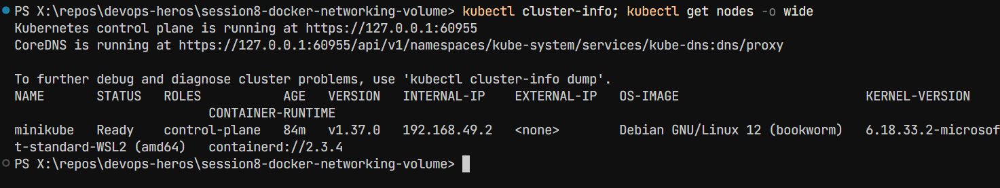

---

## Task 2: Standard Pod Deployment, Extended Inspection & Teardown (pod.yml)

**Description:** Create an individual Pod running Nginx, inspect its labels, runtime IP, node assignment, and container logs, then cleanly delete it.

**Commands:**

```bash
# Deploy Nginx pod
kubectl apply -f pod.yml

# Verify Pod readiness (1/1 Running)
kubectl get pods

# Inspect IP address and assigned worker node
kubectl get pods -o wide

# Inspect live container logs
kubectl logs nginx-pod

# Delete pod and confirm termination
kubectl delete -f pod.yml
kubectl get pods
```

**Screenshot:**
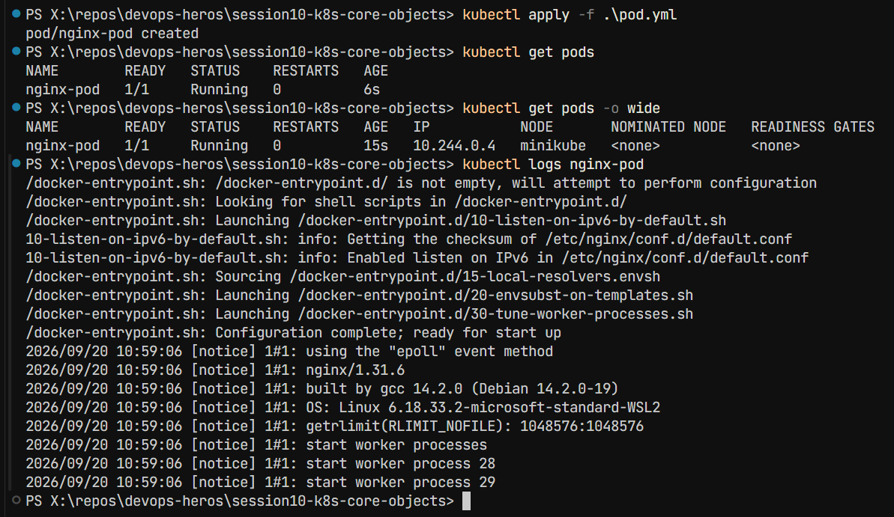

---

## Task 3: Error State Simulation — ErrImagePull & ImagePullBackOff

**Description:** Demonstrate Kubernetes error handling when pulling a non-existent container image, observing the exponential backoff loop.

**Commands:**

```bash
# Apply broken image manifest
kubectl apply -f pod-lifecycle/06-imagepullbackoff.yaml

# Observe failure state
kubectl get pods lifecycle-image-error

# Inspect failure events recorded by the Kubelet
kubectl describe pod lifecycle-image-error | grep -A 10 Events:

# Clean up
kubectl delete -f pod-lifecycle/06-imagepullbackoff.yaml
```

**Screenshot:**
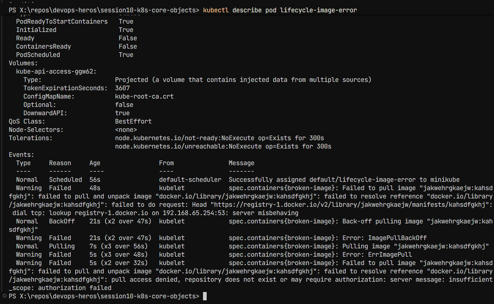

---

## Task 4: Capturing Transient Pod Lifecycle Stages (hello.yml)

**Description:** Deploy a batch execution container (busybox) configured with restartPolicy: Never and capture all three lifecycle states in real time.

**Commands:**

```bash
# In Terminal 1: Watch pods continuously
kubectl get pods -w

# In Terminal 2: Apply batch job
kubectl apply -f hello.yml

# Rapidly observe states:
# Stage 1: ContainerCreating (runtime pulling image & configuring netns)
# Stage 2: Running (process executing)
# Stage 3: Completed (process terminated with exit code 0)
kubectl get pods hello-pod

# Verify exit code and logs
kubectl logs hello-pod
kubectl delete -f hello.yml
```

**Screenshot:**
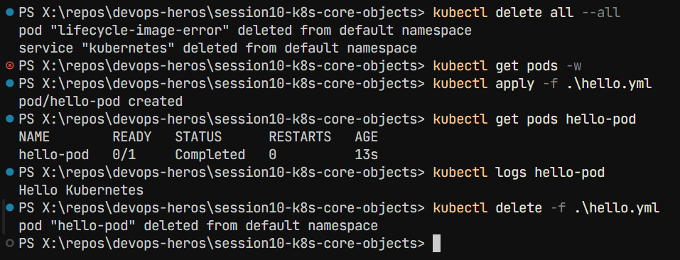

---

## Task 5: Exhaustive Pod Lifecycle States & Probes Lab (pod-lifecycle/)

**Description:** Navigate to session10-k8s-core-objects/pod-lifecycle/ and validate core lifecycle states, health checks, multi-container pods, and graceful termination.

**Commands:**

```bash
cd pod-lifecycle/

# 1. Pending State (Unschedulable due to impossible memory request)
kubectl apply -f 02-pending.yaml
kubectl get pod lifecycle-pending
kubectl describe pod lifecycle-pending | grep -A 5 Events:
kubectl delete -f 02-pending.yaml

# 2. CrashLoopBackOff (Container exit code 1 restart loop)
kubectl apply -f 05-crashloopbackoff.yaml
kubectl get pod lifecycle-crashloop -w
kubectl logs lifecycle-crashloop --previous
kubectl delete -f 05-crashloopbackoff.yaml

# 3. Readiness Probe (Validating Running != Ready)
kubectl apply -f 07-readiness.yaml
kubectl get pod lifecycle-readiness
kubectl delete -f 07-readiness.yaml

# 4. Liveness Probe (Automated restart on health failure)
kubectl apply -f 08-liveness.yaml
kubectl get pod lifecycle-liveness -w
kubectl delete -f 08-liveness.yaml

# 5. Startup Probe (Handling slow bootstrap without premature liveness death)
kubectl apply -f 09-startup.yaml
kubectl get pod lifecycle-startup
kubectl delete -f 09-startup.yaml

# 6. Init Container (Sequential setup completion prior to app start)
kubectl apply -f 10-init-container.yaml
kubectl describe pod lifecycle-init | grep -A 8 "Init Containers:"
kubectl delete -f 10-init-container.yaml

# 7. Multi-Container Pod (Main App + Logging Sidecar)
kubectl apply -f 11-multi-container.yaml
kubectl get pod lifecycle-multi-container
kubectl logs lifecycle-multi-container -c sidecar
kubectl delete -f 11-multi-container.yaml

# 8. Graceful Termination (SIGTERM trap handling)
kubectl apply -f 12-termination.yaml
kubectl delete -f 12-termination.yaml
```

**Screenshot - Probes and CrashLoop:**
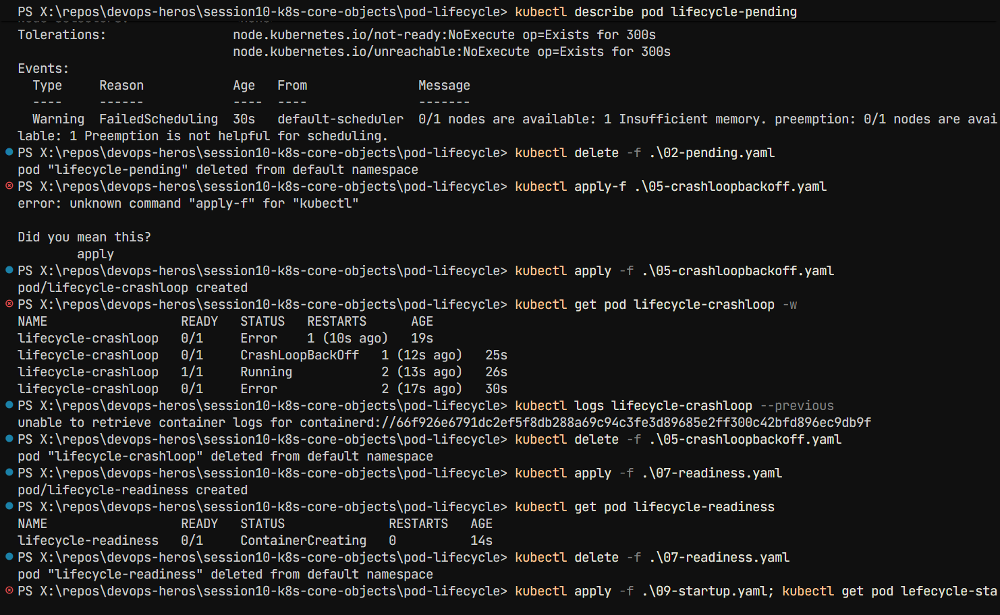

---

## Task 6: Core Controller Objects Exploration (ReplicaSet & StatefulSet)

**Description:** Deploy self-healing stateless replication via a ReplicaSet and predictable stateful storage via a StatefulSet.

### Part A: ReplicaSet

```bash
kubectl apply -f replicaset.yml
kubectl get rs nginx-rs
kubectl get pods -l app=nginx

# Test Self-Healing: Delete 1 pod manually
POD_NAME=$(kubectl get pods -l app=nginx -o jsonpath='{.items[0].metadata.name}')
kubectl delete pod $POD_NAME

# Verify ReplicaSet instantly created a new pod to maintain desired count: 3
kubectl get pods -l app=nginx
kubectl delete -f replicaset.yml
```

### Part B: StatefulSet

```bash
kubectl apply -f statefulset.yml
kubectl get statefulset mysql
kubectl get pods -l app=mysql
kubectl delete -f statefulset.yml
```

**Screenshot:**
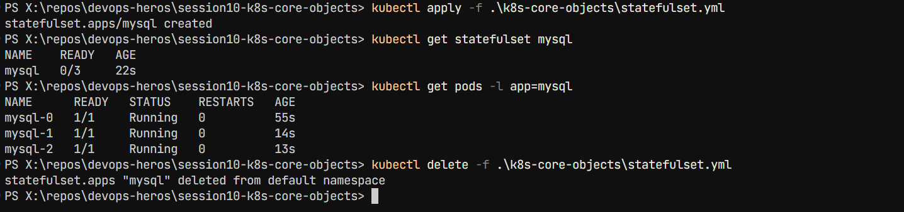

---

## Task 7: DaemonSet Architecture & Host Agent Deployment

**Description:** Deploy a host agent DaemonSet (node-exporter or node-agent-ds.yaml), demonstrating that exactly one pod runs on each eligible cluster node.

**Commands:**

```bash
kubectl apply -f k8s-core-objects/deamonset.yml

kubectl get ds node-exporter
kubectl get pods -l app=node-exporter -o wide
kubectl delete -f k8s-core-objects/deamonset.yml
```

**Screenshot:**
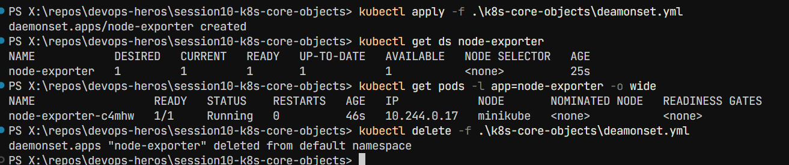

---

## Task 8: Deployment Upgrades, Rolling Updates & Instant Rollbacks

**Description:** Demonstrate declarative zero-downtime rolling updates using maxSurge: 1 and maxUnavailable: 0, and execute an immediate rollback.

**Commands:**

```bash
cd 01-rolling-update/

# 1. Deploy Version 1
kubectl apply -f deployment-v1.yaml
kubectl apply -f service.yaml
kubectl rollout status deployment/app-rolling

# 2. Trigger Rolling Update to Version 2
kubectl apply -f deployment-v2.yaml

# 3. Track rollout progress
kubectl rollout status deployment/app-rolling
kubectl get pods -l app=app-rolling --show-labels

# 4. Check rollout history
kubectl rollout history deployment/app-rolling

# 5. Execute Rollback to previous revision
kubectl rollout undo deployment/app-rolling
kubectl rollout status deployment/app-rolling

# Cleanup
kubectl delete -f service.yaml -f deployment-v1.yaml
```

**Screenshot:**
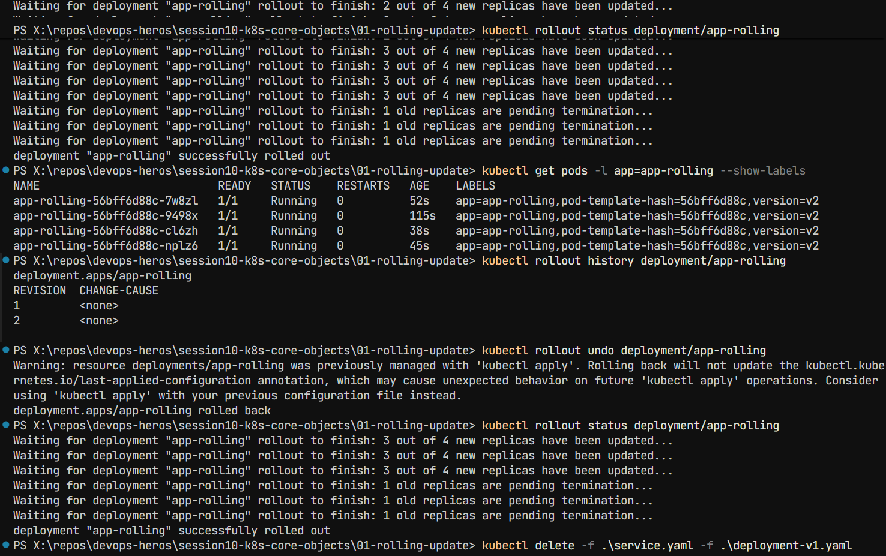

---

## Task 9: Real-World Troubleshooting Scenarios Lab (troubleshooting/)

**Description:** Resolve an in-flight rollout failure caused by an unresolvable image tag, and debug an API server rejection caused by an immutable selector label mismatch.

### Drill 1: Broken Image Rollout Failure

```bash
cd troubleshooting/

# Trigger broken deployment rollout
kubectl apply -f broken-image.yaml

# Notice rollout stalls because new pod cannot pull image
kubectl rollout status deployment/yatri-backend --timeout=30s
kubectl get pods -l app=yatri-backend

# Recover by undoing the broken revision
kubectl rollout undo deployment/yatri-backend
kubectl delete -f broken-image.yaml
```

### Drill 2: Immutable Selector Mismatch Rejection

```bash
# Attempt to apply invalid selector manifest
kubectl apply -f selector-mismatch.yaml
# Expected Error: The Deployment "selector-error-demo" is invalid

# Fix: Edit selector-mismatch.yaml so spec.template.metadata.labels.app matches spec.selector.matchLabels.app
# Then re-apply successfully
```

**Screenshot:**
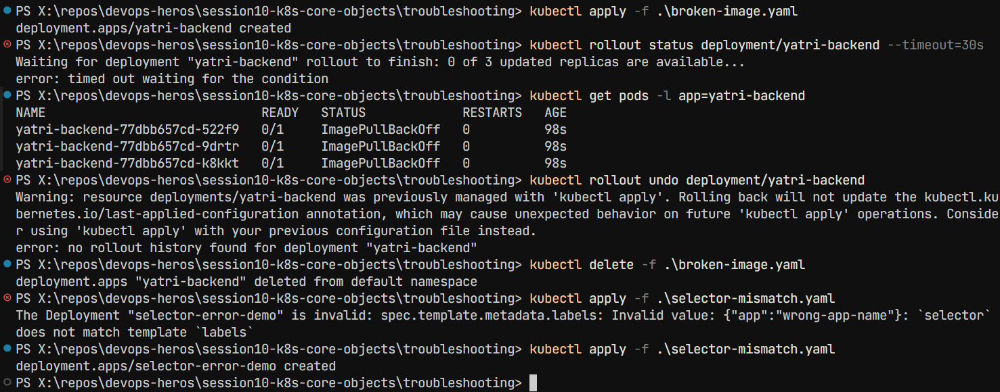

---

## Task 10: Theoretical & Architectural Conceptual Writeup

### The 4 Ports Clarified:

| Port Type         | Description                                                                      |
| ----------------- | -------------------------------------------------------------------------------- |
| **containerPort** | Port opened inside the application container process (informational in PodSpec). |
| **targetPort**    | Port on the backend pod where the Kubernetes Service routes incoming traffic.    |
| **port**          | Port exposed internally by the Kubernetes Service (ClusterIP).                   |
| **nodePort**      | Static high port (30000–32767) exposed across every worker node's external IP.   |

### Labels vs. Selectors:

| Concept       | Description                                                                                             |
| ------------- | ------------------------------------------------------------------------------------------------------- |
| **Labels**    | Key-value pairs attached to objects (e.g., `app: nginx`, `env: prod`) for metadata identification.      |
| **Selectors** | Query filters used by controllers (Deployments, Services) to group and route to matching labelled pods. |

### The 4 Deployment Strategies:

| Strategy          | Description                                                                                                                                              | Use Case                                                    |
| ----------------- | -------------------------------------------------------------------------------------------------------------------------------------------------------- | ----------------------------------------------------------- |
| **RollingUpdate** | Progressively replaces old pods with new pods; zero downtime.                                                                                            | Most common for stateless apps requiring zero downtime.     |
| **Recreate**      | Kills all v1 pods before starting any v2 pods; causes brief downtime, but avoids version conflicts.                                                      | When version conflicts are a concern.                       |
| **Blue-Green**    | Deploys two complete environments (Blue=Live, Green=New); cutover and rollback happen instantly via service selector flip. Requires 2x compute capacity. | Zero-downtime deployments with instant rollback capability. |
| **Canary**        | Deploys a small fraction of v2 pods (e.g., 10%) alongside v1 stable pods to validate real-world production metrics prior to full rollout.                | Gradual traffic shift with risk mitigation.                 |

### maxSurge vs maxUnavailable Math:

For replicas: 4, maxSurge: 1, maxUnavailable: 0:

- Max allowed pods during rollout: **4 + 1 = 5**
- Min available pods: **4 − 0 = 4** (Guarantees 100% service capacity throughout rollout)

### Resource Requests vs. Limits & Units:

| Concept      | Description                                                                                                                                     |
| ------------ | ----------------------------------------------------------------------------------------------------------------------------------------------- |
| **Requests** | Guaranteed minimum CPU/memory allocated by the scheduler to place the pod on a node.                                                            |
| **Limits**   | Maximum ceiling enforced by Linux cgroups. CPU throttling occurs if CPU limit is exceeded; container is OOM-killed if memory limit is exceeded. |

**Units:**

- **1 GB** = 10⁹ bytes (decimal, SI)
- **1 GiB** = 2³⁰ bytes = 1,073,741,824 bytes (binary, IEC)
- Kubernetes uses **mebibytes (Mi)** and **gibibytes (Gi)**

---

## Task 11: Blue-Green Deployment Execution & Instant Selector Cutover

**Description:** Deploy the Blue and Green deployments side-by-side. Validate that traffic is initially 100% Blue, flip the Service label selector to point to Green, observe the instantaneous change in Endpoints, and execute an immediate rollback.

**Commands:**

```bash
cd 02-blue-green/

# 1. Deploy both environments side-by-side (6 pods total)
kubectl apply -f deployment-blue.yaml
kubectl apply -f deployment-green.yaml

# 2. Verify both Blue and Green pods are Running
kubectl get pods -l app=myapp --show-labels

# 3. Route live traffic to Blue (v1)
kubectl apply -f service-blue.yaml
kubectl describe svc myapp-service | grep Selector
kubectl get endpoints myapp-service

# 4. Test live traffic — verify Blue responds
curl -s <http://localhost:30020> | grep "ENVIRONMENT"

# 5. THE SWITCH: Flip traffic to Green (v2) instantly
kubectl apply -f service-green.yaml

# 6. Verify selector and endpoints updated immediately to Green pods
kubectl describe svc myapp-service | grep Selector
kubectl get endpoints myapp-service

# 7. Test live traffic — verify Green now responds
curl -s <http://localhost:30020> | grep "ENVIRONMENT"

# 8. Instant Rollback: Flip selector back to Blue
kubectl apply -f service-blue.yaml
curl -s <http://localhost:30020> | grep "ENVIRONMENT"

# Cleanup
kubectl delete -f service-blue.yaml -f deployment-blue.yaml -f deployment-green.yaml
```

**Expected Terminal Output:**

```bash
# Before switch:
Selector:   app=myapp,slot=blue
<p>BLUE ENVIRONMENT</p>

# After switch:
service/myapp-service configured
Selector:   app=myapp,slot=green
<p>GREEN ENVIRONMENT</p>
```

**Screenshot:**
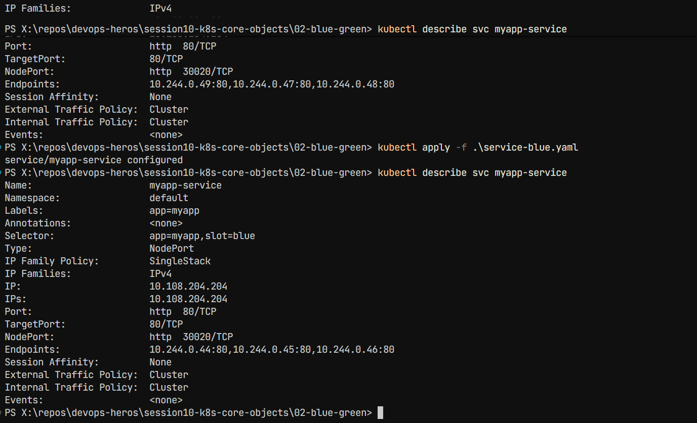

---

## Task 12: Canary Deployment Execution & Pod-Ratio Traffic Splitting

**Description:** Deploy a 9-replica stable deployment and a 1-replica canary deployment under the same Service. Run a curl loop to capture the approximate 10% canary traffic ratio, scale the canary to increase traffic share, and execute a rollback by scaling the canary to zero.

**Commands:**

```bash
cd 03-canary/

# 1. Deploy Stable baseline (9 pods = 90%) and Service
kubectl apply -f deployment-stable.yaml
kubectl apply -f service.yaml
kubectl rollout status deployment/app-stable

# 2. Deploy Canary release (1 pod = 10%)
kubectl apply -f deployment-canary.yaml
kubectl rollout status deployment/app-canary

# 3. Verify total pool has 10 pods (9 stable + 1 canary)
kubectl get pods -l app=myapp-canary --show-labels

# 4. Verify the Service endpoints list contains all 10 pod IPs
kubectl get endpoints myapp-canary-service

# 5. Run traffic test loop (20 requests) to verify ~10% canary hits
for i in $(seq 1 20); do curl -s <http://localhost:30030> | grep -o "STABLE v1\|CANARY v2"; done

# 6. Increase Canary traffic to 30% (scale canary to 3, stable to 7)
kubectl scale deployment app-canary --replicas=3
kubectl scale deployment app-stable --replicas=7
kubectl get endpoints myapp-canary-service

# 7. Rollback: Abort canary release by scaling canary to 0
kubectl scale deployment app-canary --replicas=0
kubectl scale deployment app-stable --replicas=9

# Verify 100% of traffic is returned to stable
for i in $(seq 1 5); do curl -s <http://localhost:30030> | grep -o "STABLE v1\|CANARY v2"; done

# Cleanup
kubectl delete -f service.yaml -f deployment-canary.yaml -f deployment-stable.yaml
```

**Expected Terminal Output:**

```
STABLE v1
STABLE v1
STABLE v1
CANARY v2    <-- Canary absorbs ~10% of total incoming requests
STABLE v1
STABLE v1
STABLE v1
STABLE v1
STABLE v1
STABLE v1
```

**Screenshot:**
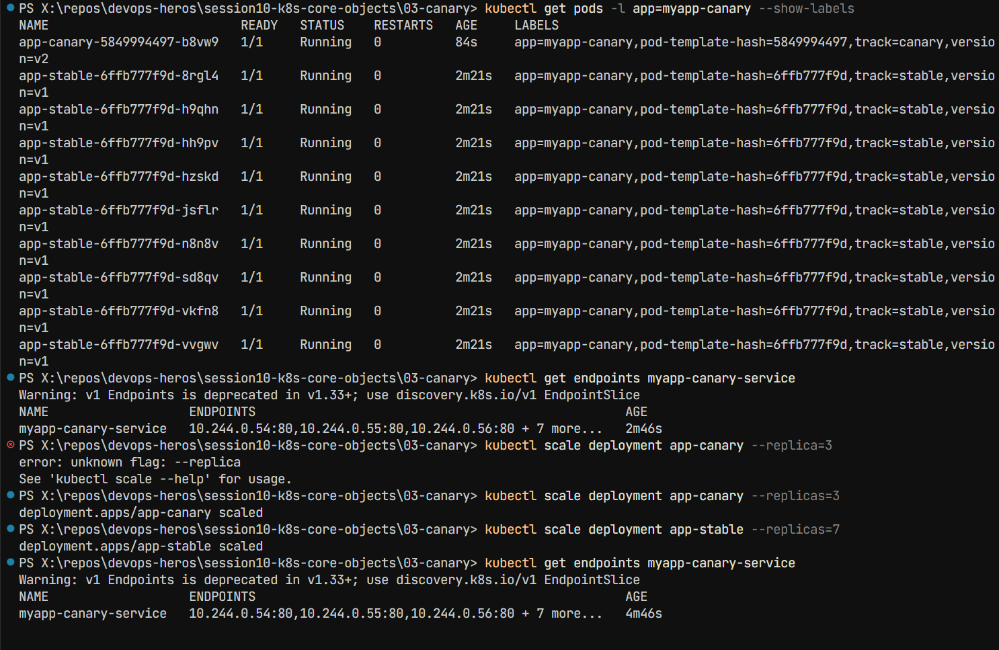

---

## Task 13: Recreate Deployment Execution & Downtime Outage Demonstration

**Description:** Deploy an application with strategy.type: Recreate. Stream live requests during an update to observe and capture the intentional downtime window where 0 pods exist between v1 termination and v2 creation.

**Commands:**

```bash
cd 04-recreate/

# 1. Deploy Version 1 and NodePort Service
kubectl apply -f deployment-v1.yaml
kubectl apply -f service.yaml
kubectl rollout status deployment/app-recreate

# 2. Verify 3 v1 pods are running
kubectl get pods -l app=app-recreate

# 3. Open Terminal 1 to watch pod state changes in real time
kubectl get pods -l app=app-recreate -w

# 4. Open Terminal 2 and start a continuous curl polling loop
while true; do curl -s --connect-timeout 1 <http://localhost:30040> | grep -o 'VERSION: [^<]*' || echo "[OUTAGE] Connection refused / 0 pods alive"; sleep 0.5; done

# 5. In Terminal 3: Trigger the Recreate update to v2
kubectl apply -f deployment-v2.yaml

# 6. Observe the curl loop output in Terminal 2 switch from v1 -> [OUTAGE] -> v2

# 7. Check rollout history and test rollback
kubectl rollout history deployment/app-recreate
kubectl rollout undo deployment/app-recreate
kubectl rollout status deployment/app-recreate

# Cleanup
kubectl delete -f service.yaml -f deployment-v2.yaml
```

**Expected Terminal Output:**

```
VERSION: v1
VERSION: v1
[OUTAGE] Connection refused / 0 pods alive
[OUTAGE] Connection refused / 0 pods alive
[OUTAGE] Connection refused / 0 pods alive
VERSION: v2 (UPGRADED)
VERSION: v2 (UPGRADED)
```

**Screenshot:**
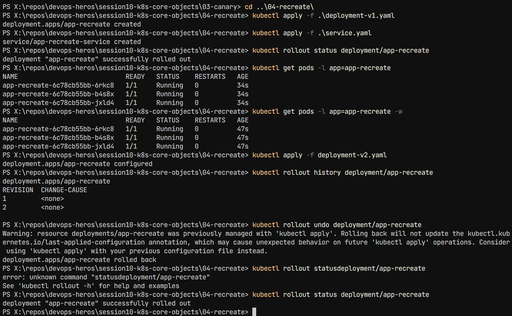

---

## File Structure

```
session10-k8s-core-objects/
├── pod.yml                              # Task 2: Standard Pod Deployment
├── hello.yml                            # Task 4: Transient Pod Lifecycle
├── replicaset.yml                       # Task 6: ReplicaSet Controller
├── statefulset.yml                      # Task 6: StatefulSet Controller
├── k8s-core-objects/
│   ├── deamonset.yml                    # Task 7: DaemonSet
│   ├── deployment.yml
│   ├── pod.yml
│   ├── replicaset.yml
│   └── statefulset.yml
├── pod-lifecycle/                       # Task 5: Pod Lifecycle Manifests
│   ├── 01-running.yaml
│   ├── 02-pending.yaml
│   ├── 03-succeeded.yaml
│   ├── 04-failed.yaml
│   ├── 05-crashloopbackoff.yaml
│   ├── 06-imagepullbackoff.yaml
│   ├── 07-readiness.yaml
│   ├── 08-liveness.yaml
│   ├── 09-startup.yaml
│   ├── 10-init-container.yaml
│   ├── 11-multi-container.yaml
│   └── 12-termination.yaml
├── 01-rolling-update/                   # Task 8: Rolling Updates
│   ├── deployment-v1.yaml
│   ├── deployment-v2.yaml
│   └── service.yaml
├── troubleshooting/                     # Task 9: Troubleshooting Scenarios
│   ├── broken-image.yaml
│   └── selector-mismatch.yaml
├── 02-blue-green/                       # Task 11: Blue-Green Deployment
│   ├── deployment-blue.yaml
│   ├── deployment-green.yaml
│   ├── service-blue.yaml
│   └── service-green.yaml
├── 03-canary/                           # Task 12: Canary Deployment
│   ├── deployment-stable.yaml
│   ├── deployment-canary.yaml
│   └── service.yaml
└── 04-recreate/                         # Task 13: Recreate Deployment
    ├── deployment-v1.yaml
    ├── deployment-v2.yaml
    └── service.yaml
```
