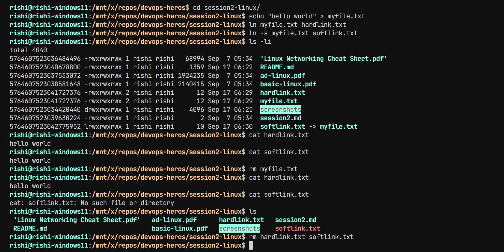
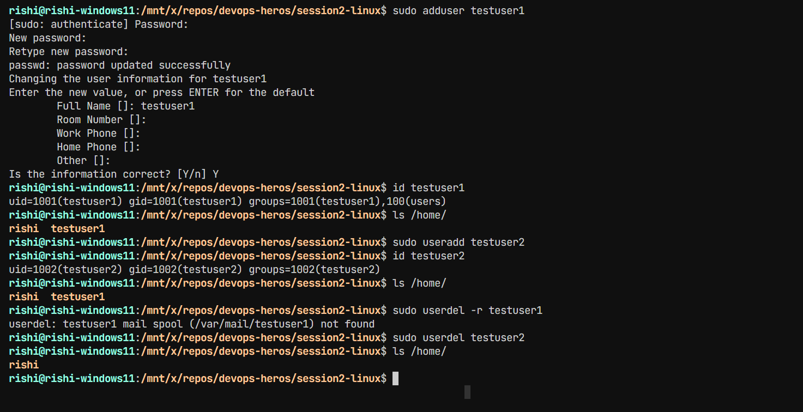
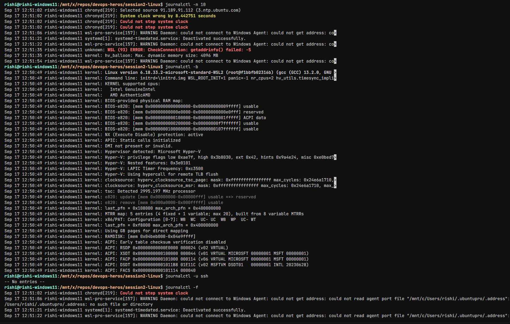
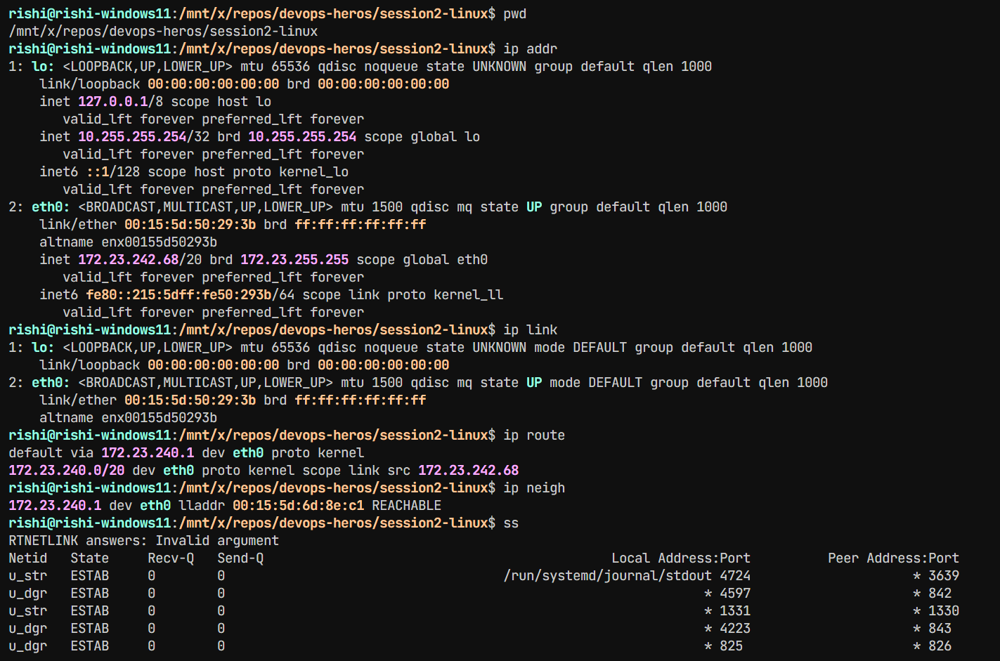

## Task 1: Soft Link & Hard Link

Created and tested both hard and soft links in Linux.

### Deletion Test

After deleting the original file, the hard link remained accessible, while the soft link became broken.

## Task 2: adduser vs useradd

`adduser` is a higher-level, user-friendly utility for creating users, while `useradd` is a lower-level command for creating users.

On Ubuntu, `adduser` is generally preferred for manually creating users because it is more user-friendly and handles common setup for you.

## Task 3: journalctl

`journalctl` is a Linux command used to view logs collected by `systemd`'s journal.

## Task 4: Linux Command Cheat Sheet

Practiced important Linux commands from the provided cheat sheet, including file management, navigation, permissions, processes, services, and disk usage.

