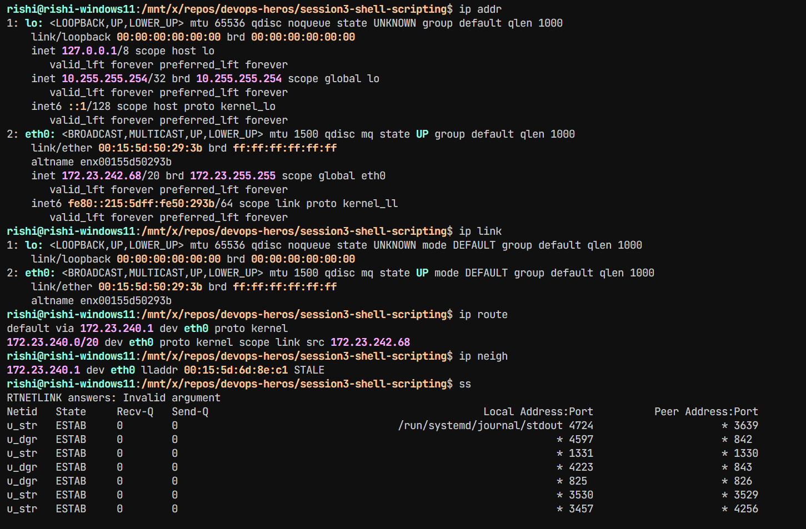

# Networking Assignment

## Task 1: Networking Commands

Practiced the networking commands and resources provided in the DevOps Heroes repository.

## Task 2: Networking Commands and Output

### 1. `ip addr`

Displays IP addresses and information about network interfaces.

### 2. `ip link`

Displays and manages the state of network interfaces.

### 3. `ip route`

Displays the routing table and shows the routes used by the system.

### 4. `ip neigh`

Displays network neighbours and the ARP/neighbor table.

### 5. `ss`

Displays network sockets, including listening TCP/UDP connections and ports.

## Command Output

