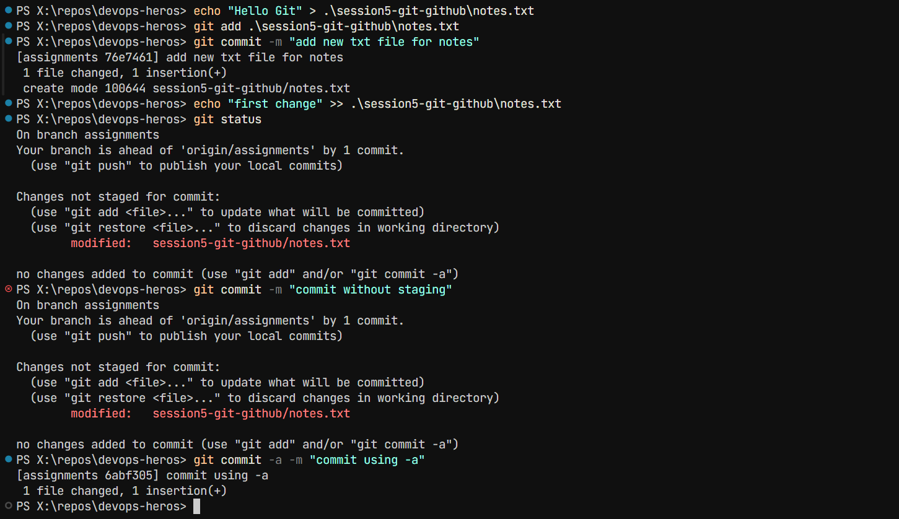
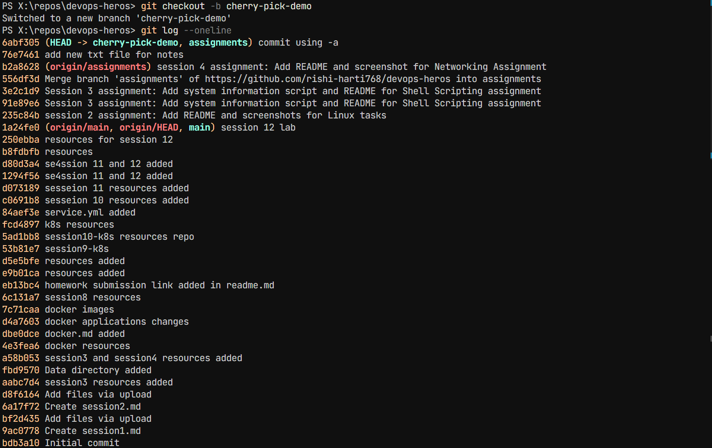
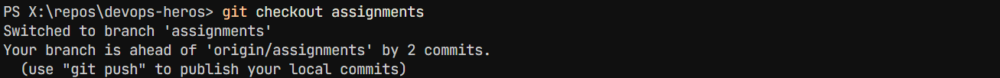
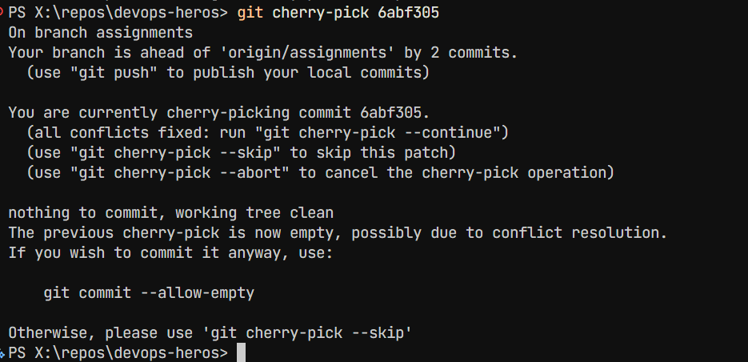

# Git & GitHub Assignment

## Task 1: git commit -m vs git commit -a -m

Practiced the difference between `git commit -m` and `git commit -a -m`.

- `git commit -m` - commits staged files.
- `git commit -a -m` - stages modified and deleted tracked files and commits them.



## Task 2: Git Cherry-Pick

Created commits in a new branch, viewed commits using `git log`, and cherry-picked a selected commit into the `main` branch.





### Commands Used

```bash
git log --oneline
git checkout -b new-branch
git add .
git commit -m "message"
git checkout main
git cherry-pick <commit-hash>
git log --oneline
```
