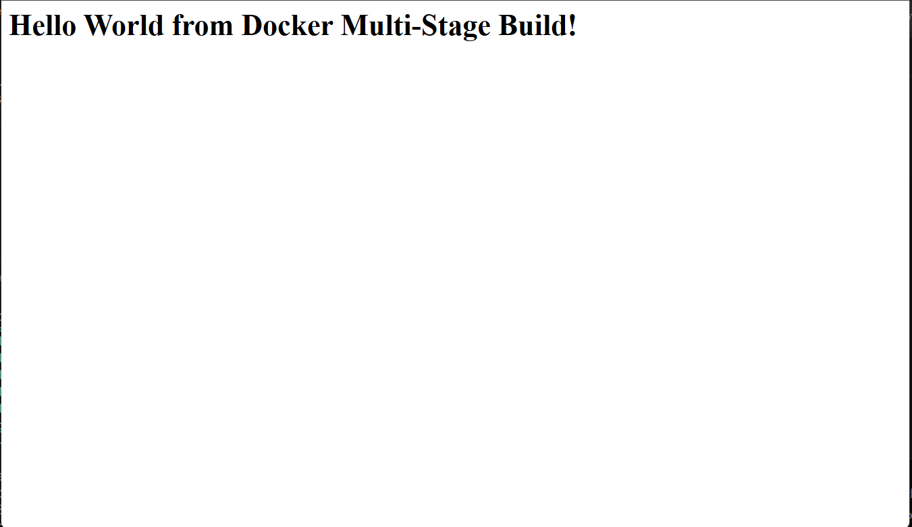

# Docker Multi-Stage Build - Node.js Application

## Overview

This practical demonstrates how to use a multi-stage Dockerfile to build and run a Node.js web application.

The Dockerfile contains two stages:

1. **Builder stage** - Installs the application dependencies and prepares the application files.
2. **Production stage** - Creates a clean runtime image with only the files and dependencies needed to run the application.

The application displays a Hello World webpage with the user's name and roll number.

---

## Explanation of the multi Stages dockerfile

### Stage 1: Builder

The builder stage:

- Uses the `node:24-alpine` base image.
- Sets `/app` as the working directory.
- Copies the package files into the image.
- Installs the project dependencies.
- Copies the application source code.

This stage contains everything required during the build process.

### Stage 2: Production

The production stage:

- Starts from a fresh `node:24-alpine` image.
- Copies the package files from the builder stage.
- Installs only production dependencies using `npm install --omit=dev`.
- Copies only `server.js` from the builder stage.
- Exposes port `8080`.
- Starts the application with `npm start`.

Using a separate production stage keeps build-only files out of the final runtime image.

---

## Build the Docker Image

Run the following commands from the `multi-stage-dockerfile` directory:

```bash
docker build -t multi-stage-hello-world .
```

This command builds the image using the final `production` stage.

## Run the Container

The application listens on port `8080` inside the container. Host port `8080` was mapped to it:

```bash
docker run -d --name multi-stage-hello-world -p 8080:8080 multi-stage-hello-world
```

The application was accessed at:

```text
http://localhost:8080
```

## Output

The container successfully displayed:

```text
Hello World from Docker Multi-Stage Build!
```



---

## Docker Concepts Practiced

| Concept                  | Purpose                                           |
| ------------------------ | ------------------------------------------------- |
| Multi-stage build        | Separates build dependencies from runtime files.  |
| `FROM ... AS`            | Names a Docker build stage.                       |
| `COPY --from`            | Copies files from an earlier stage.               |
| `npm install --omit=dev` | Installs production dependencies only.            |
| Port mapping             | Connects a host port to a container port.         |
| Alpine image             | Provides a lightweight Linux-based Node.js image. |

## Verification

View the built image with:

```bash
docker images
```

View the running container with:

```bash
docker ps
```

View the container logs with:

```bash
docker logs multi-stage-hello-world
```

## Result

The Node.js Hello World application was successfully built and run using a multi-stage Dockerfile. The production image contains only the runtime files and dependencies required to serve the application.
