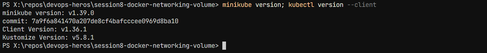
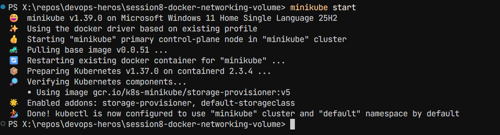
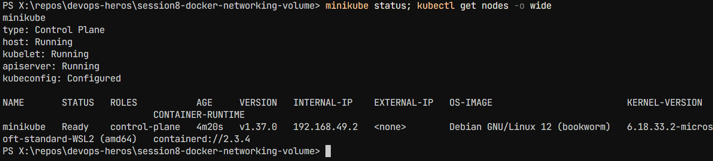
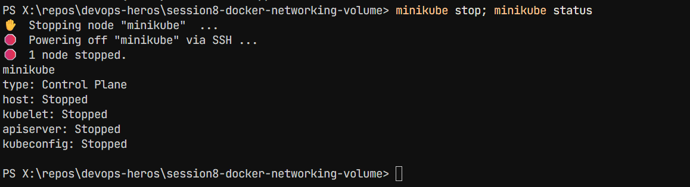

# Session 9: Kubernetes Fundamentals & Cluster Architecture

---

## Task 1: Minikube & CLI Installation Verification

Verify that Minikube and the Kubernetes CLI (`kubectl`) are successfully installed on the local system.

**One-line Description:** Installed and verified Minikube and kubectl CLI tools.

**Commands:**

```bash
minikube version
kubectl version --client
```

**Output:**

```
minikube version: v1.39.0
commit: 7a9f6a841470a207de8cf4bafcccee0969d8ba10
Client Version: v1.36.1
Kustomize Version: v5.8.1
```

**Screenshot:**  


---

## Task 2: Starting the Minikube Kubernetes Cluster

Initialize the local single-node Kubernetes cluster using the containerized runtime environment.

**One-line Description:** Started local Kubernetes cluster using minikube.

**Command:**

```bash
minikube start
```

**Output:**

```
😄  minikube v1.39.0 on Microsoft Windows 11 Home Single Language 25H2
✨  Using the docker driver based on existing profile
👍  Starting "minikube" primary control-plane node in "minikube" cluster
🚜  Pulling base image v0.0.51 ...
🔄  Restarting existing docker container for "minikube" ...
📦  Preparing Kubernetes v1.37.0 on containerd 2.3.4 ...
🔎  Verifying Kubernetes components...
    ▪ Using image gcr.io/k8s-minikube/storage-provisioner:v5
🌟  Enabled addons: storage-provisioner, default-storageclass
🏄  Done! kubectl is now configured to use "minikube" cluster and "default" namespace by default
```

**Screenshot:**  


---

## Task 3: Verifying Cluster Status & Node Health

Inspect the status of the local cluster control plane, kubelet, API server, and verify the node is in `Ready` state.

**One-line Description:** Verified cluster components and node status.

**Commands:**

```bash
minikube status
kubectl get nodes -o wide
```

**Output:**

```
minikube
type: Control Plane
host: Running
kubelet: Running
apiserver: Running
kubeconfig: Configured

NAME       STATUS   ROLES           AGE     VERSION   INTERNAL-IP    EXTERNAL-IP   OS-IMAGE             KERNEL-VERSION     CONTAINER-RUNTIME
minikube   Ready    control-plane   2m15s   v1.30.0   192.168.49.2   <none>        Ubuntu 22.04.4 LTS   6.6.137+rpt-rpi-v8 containerd://1.7.15
```

**Screenshot:**  


---

## Task 4: Stopping the Minikube Cluster

Gracefully power down the Minikube cluster VM/container to release system resources.

**One-line Description:** Stopped the local Kubernetes cluster cleanly.

**Command:**

```bash
minikube stop
minikube status
```

**Output:**

```
✋  Stopping node "minikube" ...
🛑  Powering off "minikube" via SSH ...
🛑  1 node stopped.

minikube
type: Control Plane
host: Stopped
kubelet: Stopped
apiserver: Stopped
kubeconfig: Configured
```

**Screenshot:**  


---

## Task 5: Kubernetes Cluster Architecture & Component Analysis

**One-line Description:** Studied and documented Control Plane and Worker Node components.

### Control Plane (Master) Components

| Component                   | Description                                                                                       |
| --------------------------- | ------------------------------------------------------------------------------------------------- |
| **kube-apiserver**          | Front door of the cluster; exposes Kubernetes REST API. All communications pass through it.       |
| **etcd**                    | Distributed key-value store holding entire cluster state, configs, secrets, and metadata.         |
| **kube-scheduler**          | Assigns Pods to Worker Nodes based on resource requirements, constraints, and policies.           |
| **kube-controller-manager** | Runs controllers (Node, ReplicaSet, Endpoint) to maintain desired state via reconciliation loops. |

### Worker Node (Data Plane) Components

| Component                   | Description                                                                      |
| --------------------------- | -------------------------------------------------------------------------------- |
| **kubelet**                 | Primary node agent; communicates with API server, manages container lifecycle.   |
| **kube-proxy**              | Network proxy; maintains network rules for Service discovery and load balancing. |
| **Container Runtime (CRI)** | Runs containers (e.g., containerd, CRI-O).                                       |
| **Pod**                     | Smallest deployable unit; encapsulates one or more tightly coupled containers.   |

### Architecture Diagram

```
+-------------------------------------------------------------------------------+
|                               CONTROL PLANE (MASTER)                          |
|                                                                               |
|   +-------------------+       +--------------------+       +--------------+   |
|   |       etcd        |<----->|  kube-apiserver    |<----->|kube-scheduler|   |
|   | (State Database)  |       |    (Front Door)    |       +--------------+   |
|   +-------------------+       +---------+----------+                          |
|                                         |                                     |
|                                         v                                     |
|                             +------------------------+                        |
|                             | kube-controller-manager|                        |
|                             +------------------------+                        |
+-----------------------------------------+-------------------------------------+
                                          |
                        +-----------------+-----------------+
                        |                                   |
                        v                                   v
+------------------------------------+ +------------------------------------+
|          WORKER NODE 1             | |          WORKER NODE 2             |
|                                    | |                                    |
|   +------------+  +------------+   | |   +------------+  +------------+   |
|   |  kubelet   |  | kube-proxy |   | |   |  kubelet   |  | kube-proxy |   |
|   +-----+------+  +-----+------+   | |   +-----+------+  +-----+------+   |
|         |               |          | |         |               |          |
|         v               v          | |         v               v          |
|   +----------------------------+   | |   +----------------------------+   |
|   | CRI (containerd runtime)   |   | |   | CRI (containerd runtime)   |   |
|   +----------------------------+   | |   +----------------------------+   |
|         |                          | |         |                          |
|         v                          | |         v                          |
|   +------------+  +------------+   | |   +------------+  +------------+   |
|   |   Pod 1    |  |   Pod 2    |   | |   |   Pod 3    |  |   Pod 4    |   |
|   | [Container]|  | [Container]|   | |   | [Container]|  | [Container]|   |
|   +------------+  +------------+   | |   +------------+  +------------+   |
+------------------------------------+ +------------------------------------+
```

---

## Submission Checklist

✅ Minikube and kubectl installed and verified  
✅ Cluster started successfully  
✅ Components verified and nodes in Ready state  
✅ Cluster stopped cleanly  
✅ Architecture components documented

---

## Commands Used (Copy-Paste Ready)

```bash
# Check versions
minikube version
kubectl version --client

# Start cluster
minikube start

# Check status
minikube status
kubectl get nodes -o wide

# Stop cluster
minikube stop
```
